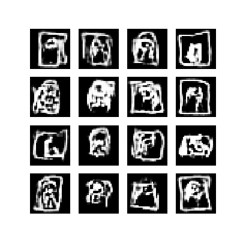
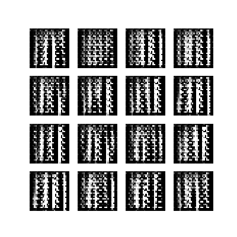

Use a Deep Convolutional Generative Adversarial Network to create new paintings of The Mona Lisa using the Google Quick Draw Dataset

## Input

## Output

## Reference
* https://www.tensorflow.org/beta/tutorials/generative/dcgan
* https://www.tensorflow.org/tutorials/sequences/recurrent_quickdraw
* https://quickdraw.withgoogle.com/data
